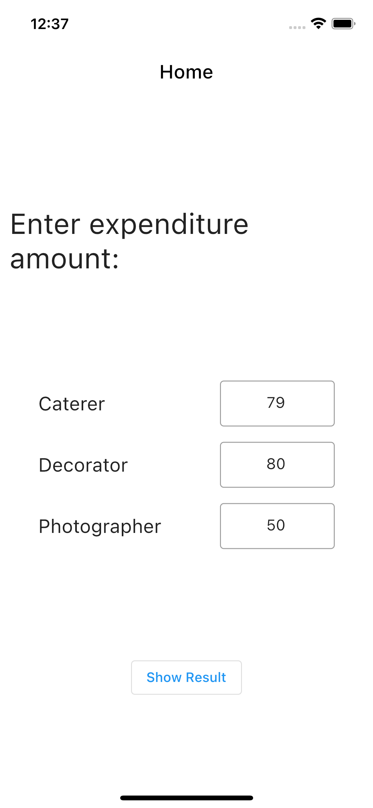
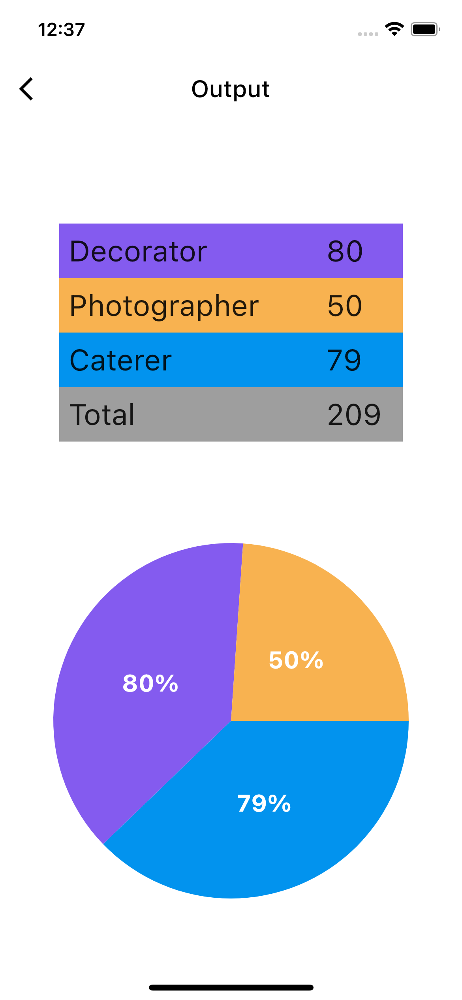

## PHERA ASSIGNMENT - FLUTTER PIE CHART AND TABLE DEMO APP

> The project is made using Flutter and it is an internship sample asignment providing by Phera.

## How to Install and Run the Project

- Clone project in your repo.
- Open project with Android Studio or VS Code (Whatevere IDE you use for Flutter).
- Open terminal in that folder and type " flutter pub get "
- Then type " flutter run lib/main.dart "

## Tools use for development ( Packages/Plugins )

- [Flutter SDK](https://flutter.dev)
- [fl_chart](https://pub.dev/packages/fl_chart)
- Android Studio | VS Code

## Detailed implementation

The complete project is create using flutter. In this project user can enter value of expenditure amount of Caterer, Decorator, Photographer and then get output as FLUTTER TABLE and PIE CHART. Total of the amount also shown in the table in output page. I havee use Flutter built in Tables for showning data in table format. and I have used FL_Chart flutter plugin for showing pie chart. Project is creating keeping NULL Safety in mind. 

## Project ScreenShots

 

